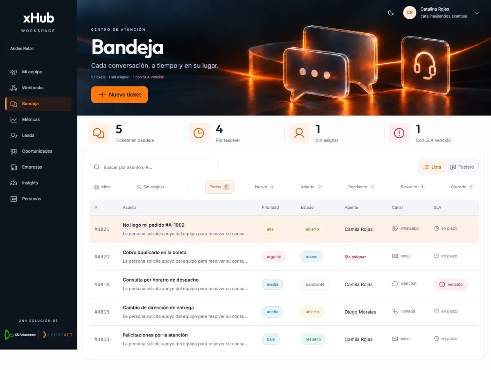
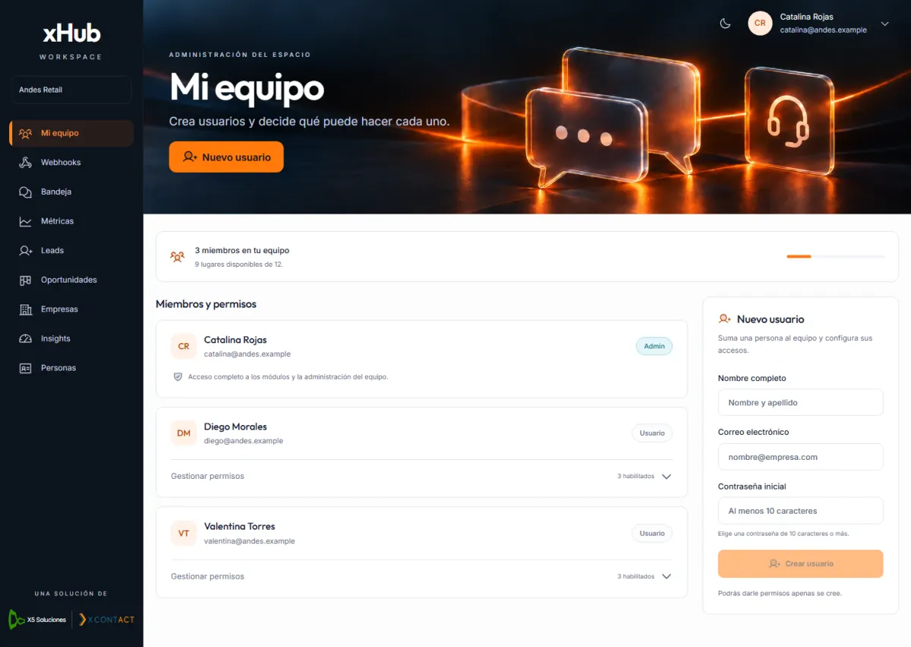
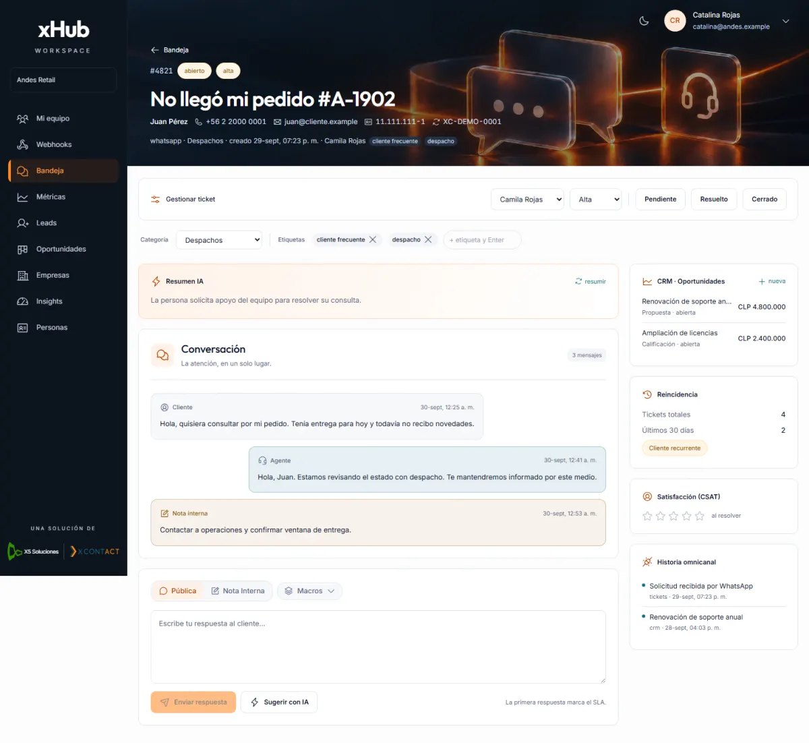
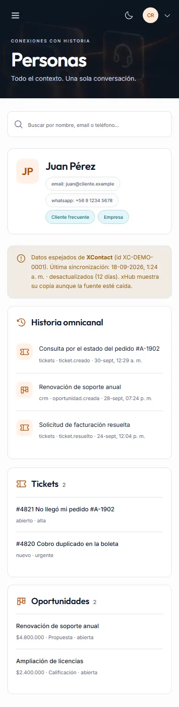

# Horizon sobre el XHub completo

La interfaz Horizon se aplica a la rama funcional completa de XHub, no a la antigua bandeja con datos semilla.

## Base e integración

- Base: `feat/tickets-reales`, commit `fd071f36c767114387ed158f71e9f9ab5bdb665e` (PR #231).
- La captura de la interfaz incorpora las novedades de `03a0dbc`; `fd071f3` añade reconciliación de identidades en el backend sin cambiar pantallas. Ambos están incluidos antes de publicar el diff visual.
- Incluye los avances de tickets reales, CRM, XContact y configuración de IA por cliente presentes en esa base.
- Rama de revisión visual: `style/horizon-completo`.
- El PR visual debe compararse con `feat/tickets-reales`. El trabajo funcional de esa rama y su integración con `main` se revisan por separado.
- No se cambia la configuración de despliegue ni se ejecuta un despliegue de staging.

Los registros públicos de GitHub de despliegue de staging no permitieron confirmar el SHA que sirve actualmente el dominio. La base funcional se identificó mediante el código, el PR activo #231 y los módulos visibles en la captura proporcionada. No se afirma haber validado una sesión real de staging.

## Pantallas cubiertas

| Área | Pantallas |
| --- | --- |
| Acceso y equipo | Login, Mi equipo, permisos y alta de usuarios |
| Atención | Bandeja, lista/tablero, creación, detalle/conversación y métricas |
| CRM | Leads, oportunidades/embudo, detalle/actividad/productos, empresas, insights y ficha de personas |
| Integraciones del cliente | Webhooks, eventos y entregas |
| Plataforma | Clientes/planes, detalle/cuotas/usuarios/llaves/scopes/IA, auditoría, IA global |
| XContact | Instancias y prueba de conectividad, salud, cola de muertos |
| Transversales | Marca de cliente, modo soporte, navegación por módulos y permisos, temas y menú móvil |

El diseño mantiene la cabecera con la ilustración aprobada, xHub centrado en el lateral, logos oficiales de X5 y XContact juntos, fuentes locales y los iconos Phosphor. En móvil el login muestra sólo el formulario; las pantallas de trabajo conservan su contenido y navegación mediante un menú desplegable.

## Contratos conservados

El diff respecto de la base no cambia `apps/api`, módulos, paquetes de backend, migraciones, Docker, workflows ni la configuración de proxy. Tampoco cambia `lib/auth-client.ts`, `lib/api.ts`, `lib/permisos.ts`, `lib/tickets.ts`, `lib/crm.ts` o `lib/marca.ts`.

- Login por `signIn.email`, cookies y redirección por subdominio existentes.
- Tickets reales mediante `/cliente/tickets`, incluidas transiciones, asignación, prioridades, categorías, etiquetas, macros, respuestas/notas, IA, CSAT y vínculos CRM.
- Acciones de CRM, usuarios/permisos, llaves/scopes, cuotas, planes, marca, soporte, IA por cliente, webhooks y XContact.
- El middleware sólo añade la exclusión de los archivos públicos `/voxia/`; conserva los guardas y la redirección por subdominio.
- El enlace a documentación calcula su URL tras montar el componente para evitar una diferencia de hidratación entre servidor y navegador. Su destino conserva `apiDocsUrl()`.
- Incluye las identidades del contacto en el detalle del ticket y el aviso de fuente XContact/última sincronización en Personas añadidos por los commits `57021c0` y `03a0dbc`.

La lista real muestra los campos disponibles en su contrato (por ejemplo canal y estado del SLA), en lugar de inventar equipos o tiempos que aparecían en la imagen de referencia.

## Validación

- Instalación con `pnpm install --frozen-lockfile`.
- Typecheck del panel y `next build`: correctos. Hay 21 archivos `page.tsx`: 20 plantillas de interfaz y una raíz que redirige. La cifra de 23 generadas por Next incluye salidas técnicas y no representa el número de funcionalidades.
- Auditoría AST de 31 componentes contra la base funcional: ninguna petición, handler o condición `disabled` original eliminada. Cuatro funciones sustituyen `window.prompt` por un diálogo accesible con el mismo texto devuelto, validación, cancelación explícita y payload; el resto de la lógica auditada se conserva. Al abandonar la página con un diálogo abierto no se ejecuta una acción pendiente.
- Backend, bibliotecas de autenticación/API/permisos y proxy: sin cambios respecto a la base.
- 120 vistas: 20 rutas en Edge, Firefox y WebKit, escritorio y móvil; fuentes locales cargadas, sin desbordamiento horizontal ni errores JavaScript persistentes. Una captura interrumpida por HMR se repitió con éxito.
- Chromium: revisión visual de los módulos en escritorio y en anchos de 390 y 320 píxeles.
- 35 pruebas de UI contra una API de prueba local: 17 de tickets, 11 de plataforma/equipo/webhooks y 7 de CRM/navegación/permisos.
- Pruebas adicionales de diálogos: foco, Tab/Shift-Tab, Escape, restauración del foco, creación de pipeline y etapa con límites de probabilidad, pérdida con/sin motivo, entrada/salida de soporte y navegación fuera sin mutación.
- Seis vistas adicionales de configuración de IA (tres motores y dos tamaños), con guardado de modelo global y por cliente contra el contrato local.
- Actualización `03a0dbc`: 19 comprobaciones adicionales del contacto del ticket y las fuentes XContact (reciente, desactualizada, sin fecha y ausente), con identificadores largos, Chromium a 1440/390/320 px y Firefox/WebKit a 320 px. Sin desbordamientos ni errores JavaScript.
- Galería local: 93 capturas de las 20 plantillas y estados representativos. [Inventario de cobertura](./inventario.md).

### Muestras visuales

La API de prueba y sus sesiones sintéticas viven fuera del repositorio. Las capturas utilizan datos ficticios y no contienen credenciales reales. No se validó el backend de staging, persistencia real, servicios externos ni dispositivos físicos. WebKit en Windows es una comprobación del motor, no una prueba en un iPhone real.

## Revisión con el backend real

1. Instalar las dependencias con el pnpm fijado en `package.json`.
2. Configurar `XHUB_API_INTERNO` hacia la API del entorno de prueba autorizado.
3. Iniciar el panel y entrar con una cuenta de ese entorno mediante el login habitual.
4. Recorrer roles, módulos y las acciones indicadas arriba con registros de prueba, antes de aprobar el despliegue.

El rediseño no incorpora usuarios demo, atajos de autenticación ni un selector de roles en el producto.

## Alcance de la revisión

El inventario incluye rutas de detalle y creación fuera del menú, formularios, permisos y estados internos. Las capturas son una selección explícita de estados representativos, no una prueba de todas las combinaciones posibles de registros, errores y roles. `xhub-modulos` está archivado: el panel vigente está en este monorepo. La documentación técnica Scalar (`/docs` y `/api/docs`) conserva su interfaz propia y no forma parte del rediseño del panel.

La revisión de las nueve ramas remotas y los PR abiertos no identificó otra rama funcional activa con pantallas pendientes de incorporar: el PR #231 contiene el panel vigente; el PR #195 modifica documentación. Las ramas antiguas de diseño usan una bandeja de demostración sustituida por la versión funcional actual.

La base funcional ya presenta un fallo en CI, antes de este cambio: el trabajo `ci` del [run 36668021687](https://github.com/voxtilabs/XHub/actions/runs/36668021687) falla en «Leyes de la casa». El backend contiene comparaciones de rol fuera del traductor. El diff visual no modifica esos archivos; no se declara CI global en verde.
