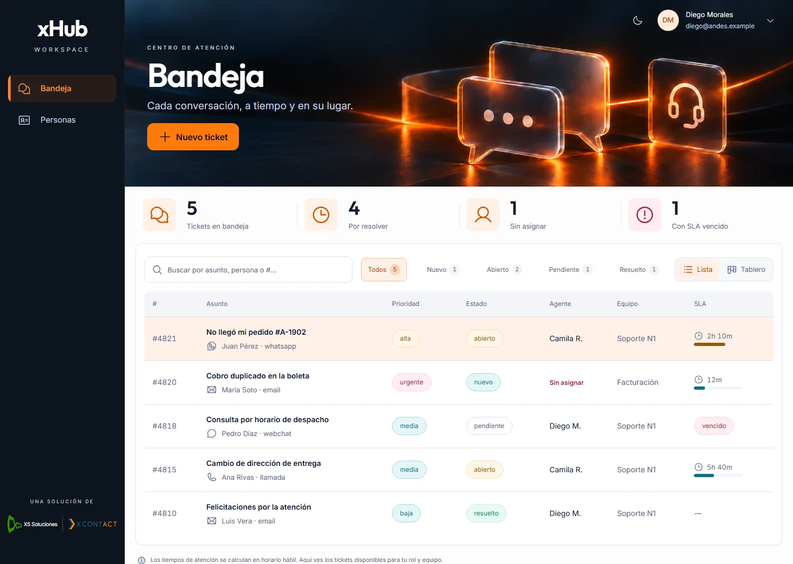
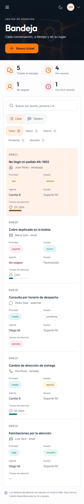
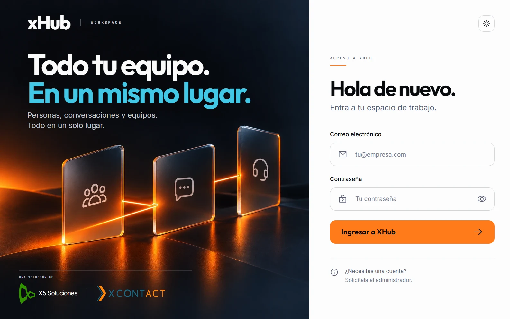
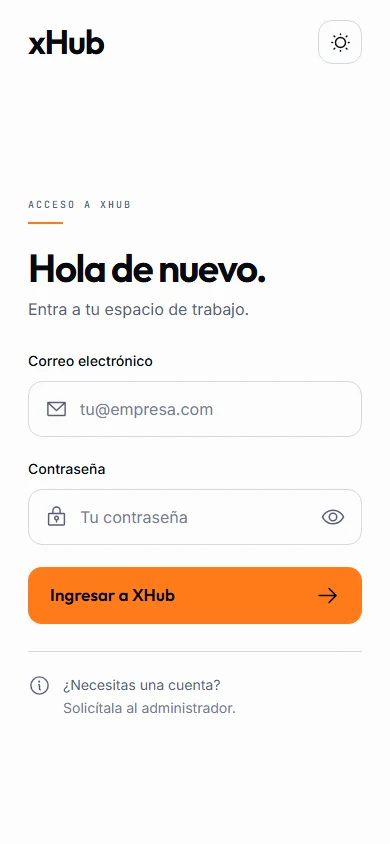

# Panel Horizon — revisión visual

Implementación del diseño aprobado para el login y las pantallas internas de XHub.
La cabecera usa una ilustración naranja; el espacio de trabajo combina lateral oscuro,
superficies claras, iconos Phosphor y tipografías locales Inter/Outfit/JetBrains Mono.
El modo oscuro y las preferencias guardadas siguen disponibles.

## Capturas

Las capturas usan datos ficticios de revisión local. No contienen credenciales ni
acreditan conexión con producción.

### Bandeja

### Inicio de sesión

## Contratos conservados

Comparado con `main` en `035f1535c0ae160a79251dc78af573e95f9df9ab`:

| Área | Comprobación |
| --- | --- |
| Backend, módulos, base de datos, migraciones y despliegue | Sin cambios de código ni configuración. |
| Inicio de sesión | La función `entrar` conserva `signIn.email({ email, password: clave })`, el tratamiento de errores y la redirección inicial a `/superadmin`. |
| Sesión y roles | Se conservan `useSession`, el cierre con `signOut`, las redirecciones por rol y la autorización con `useYo` / `RequierePermiso`. |
| Transporte de API | `lib/api.ts`, `lib/auth-client.ts`, `lib/permisos.ts` y los proxies de `next.config.mjs` permanecen idénticos. |
| Administración | Se mantienen las peticiones y acciones de usuarios, permisos, módulos, cuotas, triage, llaves, IA y auditoría/exportación. |
| Tickets | Se conservan búsqueda, filtros, transiciones y creación mediante API. El aviso de éxito del tablero tiene un texto más breve; su lógica no cambia. |
| Dependencias | Solo se agrega `@phosphor-icons/react`. El lockfile conserva las versiones y resoluciones originales de autenticación y backend. |

El middleware sigue comprobando la cookie igual que antes. Su única diferencia es
que permite cargar los recursos estáticos públicos bajo `/voxia/` antes de iniciar
sesión: imágenes, logos y fuentes. No se añade ninguna excepción para páginas o API.

El acceso a Mi equipo sigue restringido al administrador del cliente. El menú del
avatar contiene la acción de cerrar sesión. Los controles de permisos ahora se
agrupan en un desplegable y mantienen sus llamadas originales.

La comparación de AST de 21 archivos TSX no encontró peticiones, handlers ni
condiciones `disabled` existentes eliminadas. Los cambios incluyen presentación,
accesibilidad y textos de interfaz; no sustituyen operaciones de negocio.

## Validación

- Instalación con `pnpm install --frozen-lockfile --ignore-scripts --offline` correcta.
- `pnpm --filter @xhub/panel typecheck` y build de producción correctos.
- Chrome, Edge, Firefox y WebKit: 80 combinaciones de cuatro pantallas principales
  y cinco tamaños, de 320 a 1440 px, sin desbordamiento horizontal ni errores JS.
- Nueve rutas revisadas en escritorio claro/oscuro y móvil: 27 capturas adicionales.
- Pruebas de búsqueda, estados vacíos, filtros, Lista/Tablero y arrastre válido;
  pestañas de personas, formularios, permisos, módulos y navegación de auditoría.
- Menú de usuario, Escape, cierre de sesión, redirección al login y denegación por
  permisos comprobados en cuatro motores, también tras fijar el lockfile final.
- Creación de ticket: validación, error de configuración, payload, respuesta de
  éxito y reinicio del formulario contra una API ficticia local.
- El login conserva su composición fija: en móvil se muestra únicamente el acceso.

Las pruebas locales de flujos usaron una fixture externa al repositorio. **No se
incluyen la fixture, sesiones ficticias, credenciales, `.env` ni accesos de demo en
este cambio.** La revisión local no sustituye la validación de integración con el
backend real. WebKit en Windows tampoco equivale a probar Safari en un iPhone físico.

Los ejemplos estáticos que ya existían en Bandeja/Personas se conservan como estaban
en la base; este PR no conecta esas pantallas a nuevos endpoints ni reemplaza su
contenido por otra implementación de datos.

## Revisión antes de integrar

1. Ejecutar el panel con el backend habitual y las mismas variables de entorno.
2. Iniciar sesión con cuentas de prueba de plataforma, administrador y agente.
3. Comprobar en ese entorno los permisos, operaciones de administración y creación
   de tickets. Revisar la navegación y el cierre de sesión.
4. Revisar en móvil y escritorio, modo claro y oscuro, y comprobar los checks del PR.

La propuesta se mantiene en una rama separada y un PR en borrador. No requiere
migraciones ni activa un despliegue por sí misma.

## Recursos

Los logos oficiales se conservan en `apps/panel/public/voxia`. Las fuentes locales
incluyen sus licencias SIL Open Font License; Phosphor conserva su licencia MIT.
Las ilustraciones fueron generadas desde los referentes aprobados. Los textos,
formularios, filtros, botones y tablas son componentes nativos de la aplicación.

Resultado de QA visual: **passed**. Sin P0/P1/P2 pendientes en los estados revisados;
la integración con servicios reales queda para el entorno de revisión del PR.
